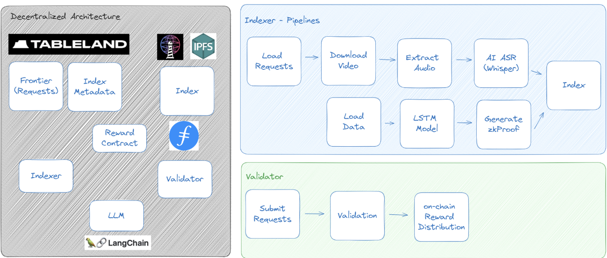

# DeRAG

### Project Overview

This project is a submission to the ["Filecoin IPC Data Economy Hackathon"](https://dorahacks.io/hackathon/filecoin-data-economy/onboarding)

Slides can be found at https://docs.google.com/presentation/d/1AVLqkqH05mcDIStsDQljMHI_xg8kGiZ06iIAb6t2Bsg/edit?usp=sharing

#### Demo

- https://www.loom.com/share/910016b14def41628351682c4efd785f
- You can run the model at localhost:3001 with LangSmith to investigate queries


## Trustless Verification

### ZKML approach
- We have added a python notebook to illustrate the process
  - https://github.com/pedialab/fil-dataecon-hackathon/blob/main/apps/ezkl/house_price_prediction.ipynb

### Archiecture



### Techstack in API

- lighthouse for files upload
- Nestjs
- for youtube
  - `youtubei` metadata loading
  - `youtube-transcript` for transcript (testing when whisper not in use)

### Techstack of ML
- langchain / openAI for LLM
- `whisper` for transcript and translation
- langsmith for LLM observability

### Techstack of validator
- ezkl

### Techstack of Smart Contract

- Foundry
- cd apps/contracts
- forge install
- forge build

- for test, specify calibration testnet rpc url explictly
  -  forge test --rpc-url https://calibration.filfox.info/rpc/v1

### Building Env

- We use turborepo for monorepo cli
- it is recommend to pair with `env-cmd` to populate environment from `.env`
- values can be refer to `env.sample`

typical commands at

```
# start server
env-cmd pnpm dev
# eslint
env-cmd pnpm lint
# format(prettier)
env-cmd pnpm format
```

### Setup
- whisper
- https://github.com/openai/whisper

#### Testing


```
# unit test (.spec.ts) / integration test (.int.spec.ts)
env-cmd pnpm test

```